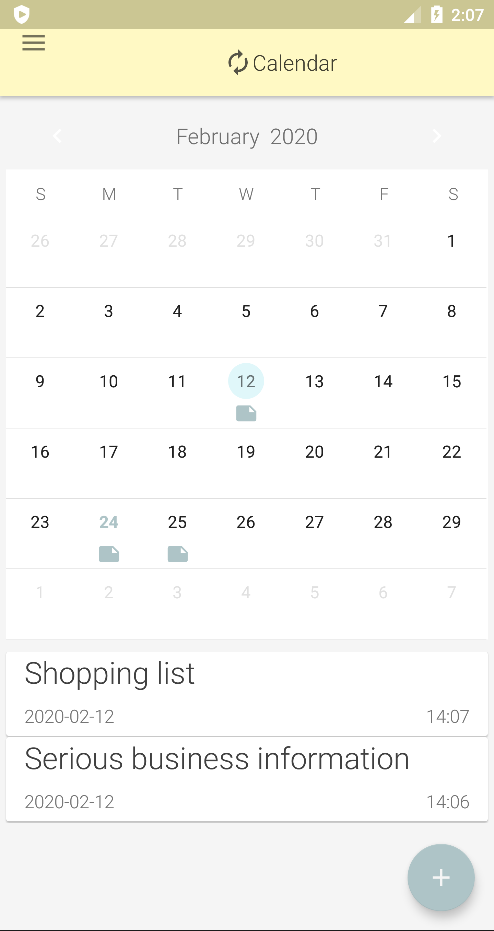
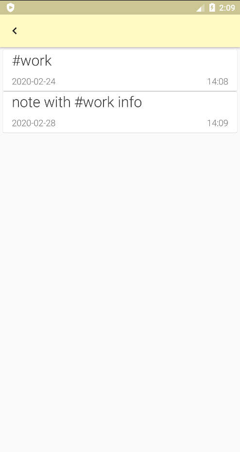

# Simple android notes app with some additional functions

**You can:**
<table width = 760>
  <tr>
     <td>
      Create notes on a certain dates
       
      
       
     </td>
     <td>
      Write hashtags
       
      
       
     </td>
     <td>
      Get all notes containing specific hashtag
       
      
       
     </td>
</tr>
</table>

**Made using:**
- MVP + Dagger 2
- ButterKnife
